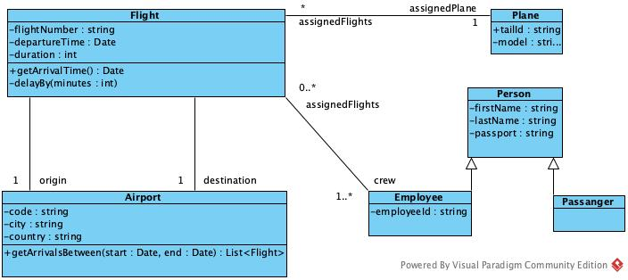

# Software Engineering Fundamentals - Lab #2: Basic Design

### Time: 30 minutes


## Introduction

This assessment evaluates the following CLOs:

* CLO 3: communicate with the client and team members using appropriate UML models.
* CLO 4: implement the system using appropriate tools and techniques

The following topics are assessed:

- Object Oriented Structural Design.
- Related UML Diagrams to implementation code. 


## Instructions

There is a single exercise you need to complete.
To do so, clone your own classroom repository, and solve the following exercise.

Answer the corresponding questions by writing them in the file on the root of your repo, named `ANSWERS.md`. 
Always use the following template to answer each question, replacing the number for corresponding one:

```
# 1
My answer is this
```

#### IMPORTANT
* Push ALL your changes to your github repository
* Submit your repository URL in CANVAS Assignment. Only submitted links can be marked.

## Exercise

Given the following Diagram for the `airport` package:



## Part A (65 points total)
In the folder `src/main/java` generate the java Classes associated with the Diagram. 
Methods should be empty or return a dummy value (empty String `""`, or `0`, or `0.0`, depending on its return value).

Pay attention to upper and lower cases in naming (classes, methods, attributes, etc). Respect case sensitivity.

## Part B (35 points total)
There are some mistakes in this design. 
Answer the following questions:

1. (15pts) With the current design, can you implement a `getPassangers()` method in the `Flight` Class? Explain your answer.

2. (10pts) What visibility issues in attributes and methods do you see in the diagram? State all cases, one per line. Explain your answer.

3. (10pts) If you wanted to ensure that at least 5 `Employee`s are part of the crew, how would you change the multiplicity? Explain your answer.


## Rubric

| | Requirements|
| --- |------|
| HD | Implementation code is complete with methods and attributes. Naming is accurate. Relationships are all correct.  All questions are clear and correctly answered.  |
| DI | Implementation code is complete with methods and attributes. Naming is accurate. Relationships are all correct.  All questions are answered correctly, at the most one of them incomplete. Or explanation is not clear enough/confusing/too long. |
| CR | Implementation code is complete with methods and attributes. Naming is accurate. Some relationships are incomplete/inaccurate.  At least two questions are complete.  |
| PA | Implementation code is complete with methods and attributes.  Naming is mostly accurate. Some relationships are incomplete/inaccurate. At least two questions are complete. |
| NN | Implementation code is incomplete with some methods and attributes. Some attributes/methods are wrong, and some relationships are wrong. Naming is mostly accurate. Two or more questions are incorrect.|
